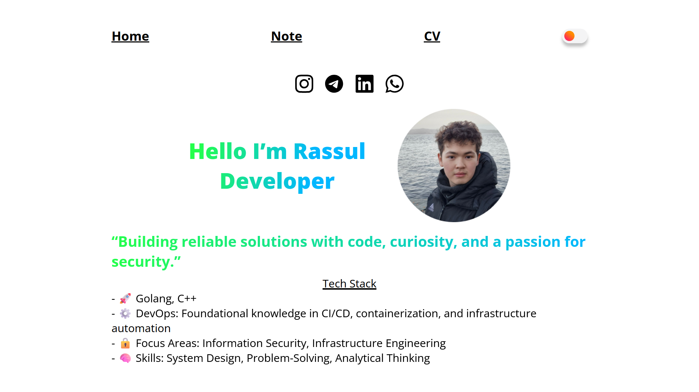
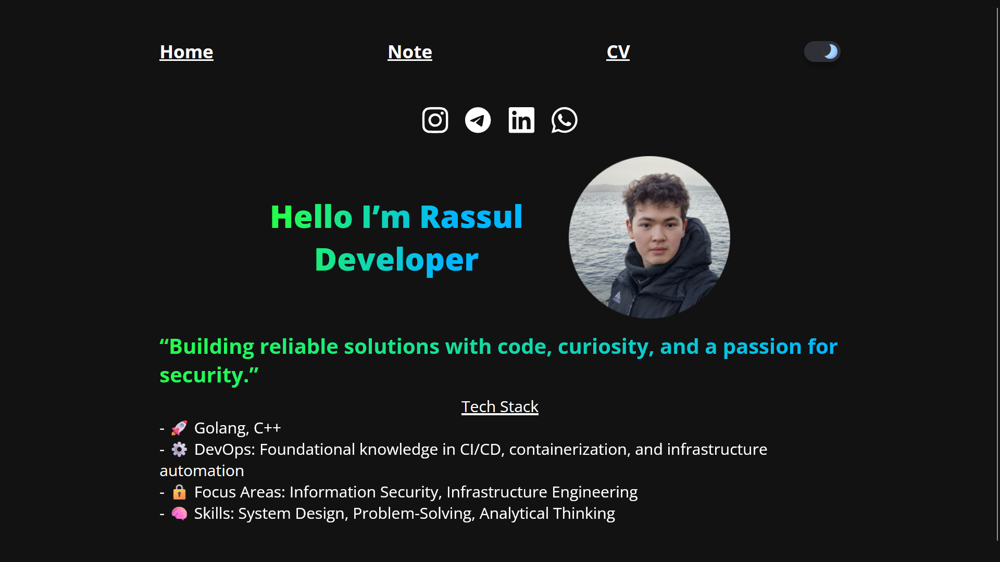

# Personal website(Rasul Nurlybekov)-> PW

### Stack
(almost) Backend - Golang Mux\
✅Frontend - why would I complex it? HTMX html, css

**to run write `go mod tidy` and then `make run`** 

### Backend [TODOs]
1. ~~Add IsAdmin in struct of User~~
2. Session Cookie Token
3. CSRF(cross-site request forgery) protection

#### IDEAS
* sender to the mail about new posts from blog; place it at the footer as new block

