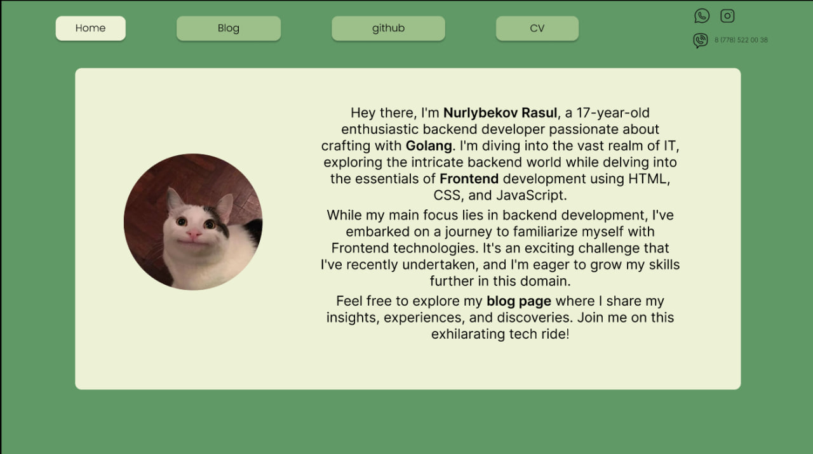

# Personal website(Rasul Nurlybekov)

### Frontend [problems]
1. recreate the design in Figma
2. just run it by help of Claude
3. and make it more responsive

* to run write `make run` or `go run ./main.go`

### Backend [problems]
* the backend is not refreshing the css, idk why? 

#### IDEAS
*  sender to the mail about new posts from blog
* forum for newsletters
